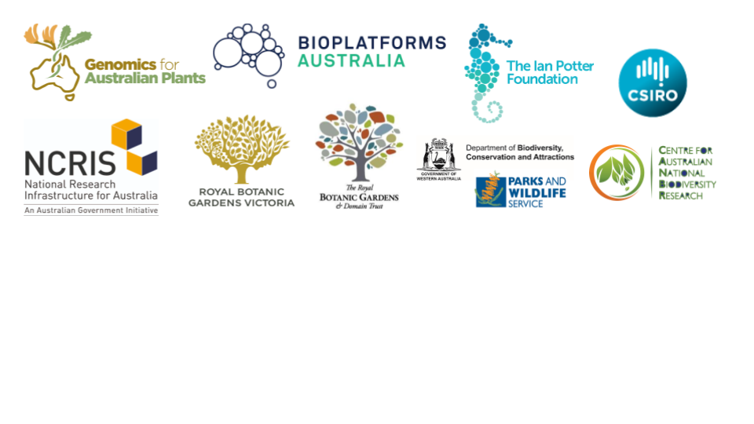

<ss>Under development: 2020</ss>
# Welcome to plant genomics training

## What's here?

This website contains training, resources and links for plant genomics and bioinformatics.

The website is under development and will expand over the next three years.

**We welcome your contributions!** In particular, we are looking for tutorials covering concepts, software, and workflows for common analyses in plant genomics. If you have any that you wish to share, or any corrections or suggestions for the website, please email anna.syme<code>@</code>rbg.vic.gov.au.

More information about page content and contributing is at the GitHub repository [https://github.com/plant-genomics/training](https://github.com/plant-genomics/training).

<ss>Show or hide the left-hand menu</ss> click the icon in the top menu bar that looks like this 

<ss>Find information</ss> click on the topics in the left-hand menu or use the search bar in the top right corner

<ss> Return to this home page</ss> click on the leaf icon in the top left corner 

## Funders and supporters

This training aims to support the Australian plant genomics community as part of the Genomics for Australian Plants project [(link)](https://www.genomicsforaustralianplants.com/), by Bioplatforms Australia.

This nationally-inclusive and collaborative initiative is supported by funding from Bioplatforms Australia through the Australian Government National Collaborative Research Infrastructure Strategy (NCRIS), the Ian Potter Foundation, Royal Botanic Gardens Victoria, the Royal Botanic Gardens and Domain Trust, CSIRO, Centre for Australian National Biodiversity Research and the Department of Biodiversity, Conservation and Attractions, Western Australia.

