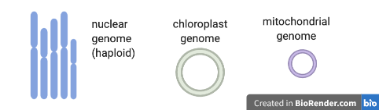
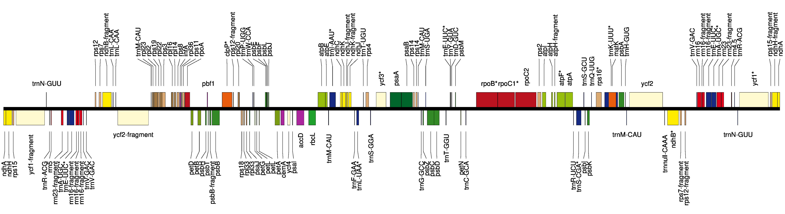

# Assemble and annotate a chloroplast genome

*<ss>\*New\*</ss>*
 
*<ss>Feedback, comments, corrections: anna.syme<code>@</code>rbg.vic.gov.au</ss>*

## What is genome assembly?

* Genome assembly is the process of joining together DNA sequencing fragments into longer pieces, ideally up to chromosome lengths.
* The DNA fragments are produced by DNA sequencing machines, and are called "reads". These are in lengths of about 150 nucleotides (base pairs), to up to a million+ nucleotides, depending on the sequencing technology used. Currently, most reads are from Illumina (short), PacBio (long) or Oxford Nanopore (long and extra-long).
* It is difficult to assemble plant genomes as they are often large (for example, 3,000,000,000 base pairs), have many repeat regions (such as transposons), and may be polyploid.
* This tutorial shows genome assembly for a smaller data set - the plant chloroplast genome - a single circular chromosome about 160,000 base pairs long. 

## What's in this tutorial?

* The chloroplast genome of the sweet potato has been sequenced.
* This has produced many sequencing reads - DNA fragments.
* We will try to join these reads together to make the whole chloroplast genome sequence.
* We will use the Galaxy Australia platform (a web page) to run our analysis.
* This tutorial assumes some familiarity with Galaxy and bioinformatics - if you are new to either of these, we recommend the [Galaxy Australia Training](https://galaxy-au-training.github.io/tutorials/) tutorials *Get started, Learn key tasks, Quality control, Genome assembly, *and* Genome annotation*, as this chloroplast genome assembly tutorial is slightly more complicated.
* You can follow all the steps, or skip any <op>optional</op> steps:
* <st>Get data &rarr; <op>Read quality</op> &rarr; Assemble&rarr; Polish &rarr; <op>View reads</op> &rarr; <op>Annotate</op>  &rarr; <op>Repeat with new data</op></st>

## What's *not* in this tutorial?

*  The best assembly of the sweet potato chloroplast data: here, we are using a data subset.
* A full explanation of all the steps involved and all the possible variations in the workflow; answers to some of the questions.
* A workflow to assemble and annotate the chloroplast genome of any plant species: in this tutorial some steps are manual, and tools and settings may not be optimal for other plant species.
* A workflow to assemble the nuclear genome of any plant species. The process shown here is generally applicable to assembling plant nuclear genomes but there would be extra steps (and much more time) involved. For example, additional sequencing would usually be run on 10X, BioNano or HiC to produce information to link up longer nuclear chromosome pieces and to separate out the maternal and paternal haplotypes.

## Get data

* Log in to [Galaxy Australia](https://usegalaxy.org.au/) and create a new history.
* The data is from this paper: [Zhou C, Duarte T, Silvestre R et al. 2018](https://doi.org/10.12688/gatesopenres.12856.1), hosted at EBI ENA.
<!--How I got these files: see text at end of this document -->

* Original FASTQ reads: Illumina (SRR6828568) and Nanopore (SRR6828567).
* These data sets have been highly reduced in size for this tutorial.
* In a new browser tab, go to this webpage [https://zenodo.org/record/3567224](http://doi.org/10.5281/zenodo.3567224)
* Find the file called <fn>sweet-potato-chloroplast-illumina-reduced.fastq</fn>
* Right click on file name: select "copy link address"
* In Galaxy, go to <ss>Get Data</ss> and then <ss>Upload File</ss>
* Click <ss>Paste/Fetch data</ss>
* A box will appear: paste in link address
* Click <ss>Start</ss>; click <ss>Close</ss>
* The file will now appear in the top of your history panel.
* Repeat for the Nanopore reads <fn>sweet-potato-chloroplast-nanopore-reduced.fastq</fn>
* We now have two FASTQ read files in our history.
* Click on the eye icon next to one of the FASTQ sequence files.
* View the file in the centre Galaxy panel.

## Check read quality

* <op>Optional. Skip this section for a quicker tutorial</op>
* We will look at the quality of the nanopore reads.
* In the tool panel, search for [Nanoplot](https://github.com/wdecoster/NanoPlot)
* For <ss>Select multifile mode</ss> select  <fn>batch</fn>.
* For  <ss>Type of file to work on</ss> select <fn>fastq</fn>
* For <ss>files</ss> select the nanopore FASTQ file
* Click <ss>Execute</ss>
* There are five output files.
* View the <fn>Histogram Read Length</fn> file

<!-- the HTML report is not currently renedering properly unless downloaded, but this has a nice plot of read length vs av qual -->

!!! note ""
    What summary statistics would be useful to look at?

    ??? "Click for answer"
         
        This will depend on the aim of your analysis, but usually:

        * **Sequencing depth** (the number of reads covering each base position; also called "coverage"). Higher depth is usually better, but at very high depths it may be better to subsample the reads, as errors can swamp the assembly graph.

        * **Sequencing quality** (the quality score indicates probability of base call being correct). You may trim or filter reads on quality. Phred quality scores are logarithmic: phred quality 10 = 90% chance of base call being correct; phred quality 20 = 99% chance of base call being correct. More detail [here](https://en.wikipedia.org/wiki/Phred_quality_score).

        * **Read lengths** (read lengths histogram, and reads lengths vs. quality plots). Your analysis or assembly may need reads of a certain length.

<!--
sequencing depth
total bases, to work out depth (num of reads covering each base position)
e.g. total bases = 13 million
(total bases = num reads x av read length)

if genome size  = 160,000
then depth 13,000,000 / 160,000
depth = approx X80

read lengths histogram
number of reads per each bin of read lengths

Weighted Histogram of read lengths
number of BASES per each bin of read lengths
-->

* <op>Optional further steps:</op>
* Find out the quality of your reads using other tools such as fastp or FastQC. 
* To visualize base quality using emoji you can also use FASTQE :smile:
* Run FASTQE for the illumina reads. In the output, look at the mean values (the middle row)
* Repeat FASTQE for the nanopore reads. In the tool settings, increase the maximum read length to 30000.

<!-- get max read length from nanoplot nano stats -->
<!-- the mean value is quite bad for nanopore reads, as would be expected -->

## Assemble reads

* <st>Assemble:</st>
* In the tool panel, search for "Flye".
* For <ss>Input reads</ss> select <fn>sweet-potato-chloroplast-nanopore-reduced.fastq</fn>
* Leave other settings as default, except for <ss>estimated genome size</ss> add <fn>160000</fn>
* Click <ss>Execute</ss>
* <st>View assembly outputs:</st>
* There are five output files.
* *Note: this tool is heuristic; your results may differ slightly from the results here, and if repeated.*
* View the <fn>log</fn> file and scroll to the end.
* How many contigs (fragments) were assembled?
* What is the length of the assembly?
* View the <fn>assembly_info</fn> file.
* What are the contig names and lengths?
* The assembly sequence is in the <fn>consensus</fn>. Re-name this <fn>flye-assembly.fasta</fn>
<!-- note assemblies won't be the same size, may differ 100bp etc, due to heuristics in assembler and other tools -->

* <st>View the assembly:</st>
* In the tool panel, search for "Bandage".
* Run "Bandage Info" on the Flye output file <fn>Graphical Fragment Assembly</fn> (not the "assembly_graph" file) with the default settings. 
* View the ouput file: how many nodes and edges are there?
* Run "Bandage Image" on the Flye output file <fn>Graphical Fragment Assembly</fn>, clicking "Yes" to display "Node length labels". 
* (Note that some text may be cut off this image due to a bug, under investigation). 
<!-- node names and lengths are not rendering properly for now -->

* Your assembly graph may look like this:

<!-- replace with the galaxy version when bug is fixed -->

!!! note ""
    What is your interpretation of this assembly graph?

    ??? "Click for answer"
         
        One interpretation is that this represents the typical circular chloroplast structure: There is a long single-copy region (the node of around 78,000 bp), connected to the inverted repeat (a node of around 28,000 bp), connected to the short single-copy region (of around 11,000 bp). In the graph, each end loop is a single-copy region (either long or short) and the centre bar is the collapsed inverted repeat which should have about twice the sequencing depth.

* <op>Optional further steps:</op>
* Repeat the Flye assembly with different parameters, and/or a filtered read set. 
* Try an alternative assembly tool, such as Canu or Unicycler. 
        
## Polish assembly

* Short illumina reads are more accurate the nanopore reads. We will use them to correct errors in the nanopore assembly.
* <st>Map short reads to the assembly:</st>
* In the tool panel, search for "bwa mem", and click on "Map with BWA-MEM"
* For <ss>Will you select a reference genome from your history</ss> select <fn>Use a genome from history</fn>
* For <ss>Use the following dataset as the reference sequence</ss> select <fn>flye-assembly.fasta</fn>
* For <ss>Algorithm for constructing the BWT index</ss> select <fn>Auto. Let BWA decide</fn>
* For <ss>Single or Paired-end reads</ss> select <fn>Single</fn>
* For <ss>Select fastq dataset</ss> select <fn>sweet-potato-illumina-reduced.fastq</fn>
* For <ss>Set read groups information?</ss> select <fn>Do not set</fn>
* For <ss>Select analysis mode</ss> select <fn>1. Simple Illumina mode</ss>
* Click <ss>Execute</ss>
* This maps the short reads to the assembly, and creates an alignment file.
* Re-name this file <fn>illumina.bam</fn>
* <st>Polish the assembly:</st>
* In the tool panel, search for "pilon", and click on "pilon"
* For <ss>Source for reference genome used for BAM alignments</ss> select <fn>Use a genome from history</fn>
* For <ss>Select a reference genome</ss> select <fn>flye-assembly.fasta</fn>
* For <ss>Type automatically determined by pilon</ss> click <fn>Yes</fn>
* For <ss>Input BAM file</ss> select <fn>illumina.bam</fn>
* For <ss>Variant calling mode</ss> select <fn>No</fn>
* For <ss>Create changes file</ss> select <fn>Yes</fn>
* Click <ss>Execute</ss>
* This compares the short reads to the assembly, and creates a polished (corrected) assembly file.

* There are two outputs: a <fn>fasta</fn> file and a <fn>changes</fn> file.
* What is in the <fn>changes</fn> file?
* Re-name the fasta output file <fn>polished-assembly.fasta</fn>
* Find and run the tool called "Fasta statistics" on the original flye assembly and the polished version.

!!! note ""
    How does the short-read Pilon-polished assembly compare to the unpolished <fn>flye-assembly.fasta</fn>?

    ??? "Click for answer"
         
        This will depend on the settings, but as an example: your polished assembly might be about 10-15 Kbp longer. Nanopore reads can have homopolymer deletions - a run of AAAA may be interpreted as AAA - so the more accurate illumina reads may correct these parts of the long-read assembly. In the <fn>Changes</fn> file, there may be a lot of cases showing a supposed deletion (represented by a dot) being corrected to a base. 

* <op>Optional further steps:</op>
* Run a second round (or more) of Pilon polishing. Keep track of file naming; you will need to generate a new bam file first before each round of Pilon.
* Run an alternative polishing tool, such as Racon. This uses the long reads themselves to correct the long-read (Flye) assembly. It would be better to run this tool on the Flye assembly before running Pilon, rather than after Pilon. 

## View reads

* <op>Optional. Skip this entire section for a quicker tutorial</op>
* We will look at the original sequencing reads mapped to the genome assembly.
* In a new browser tab, go to this webpage [https://zenodo.org/record/3567224](http://doi.org/10.5281/zenodo.3567224)
* See the two files with the "-tiny" in their file name. These are very cut-down files of sequencing reads.
* Upload these files to Galaxy.
<!-- later: these will be in shared history and/or shared data lib -->
* <st>Map the reads:</st>
* Map the Illumina reads (the new "tiny" dataset) to the <fn>polished-assembly.fasta</fn>, the same way we did before, using bwa mem.
* This creates one output file: re-name it <fn>illumina-tiny.bam</fn>
* Map the Nanopore reads (the new "tiny" dataset) to the <fn>polished-assembly.fasta</fn>. The settings will be the same, except <ss>Select analysis mode</ss> should be <fn>Nanopore</fn>.
* This creates one output file: re-name it <fn>nanopore-tiny.bam</fn>
* <st>Create a visualization of the mapped reads:</st>
* In the tool panel, search for "JBrowse", and click on "JBrowse genome browser"
* This tool creates a visualization of our genome assembly with some of the original sequencing reads mapped to it.
* For <ss>Reference genome to display</ss> select <fn>Use a genome from history</fn>
* For <ss>Select the reference genome</ss> select <fn>polished-assembly.fasta</fn>
* For <ss>Produce Standalone Instance</ss> select <fn>Yes</fn>
* For <ss>Genetic Code</ss> select <fn>11. The Bacterial, Archaeal and Plant Plastid Code</fn>
* For <ss>JBrowse-in-Galaxy Action</ss> select <fn>New JBrowse instance</fn>
* <ss>Insert Track Group</ss>
* Now we'll set up two tracks (or rows) to display underneath the assembled genome.
* One track will be the nanopore reads; one track will be the illumina reads.
* <ss>Insert Annotation Track</ss>. This is our first track, or row, to be displayed under the reference genome.
* For <ss>Track Type</ss> select <fn>BAM pileups</fn>
* For <ss>BAM track data</ss> select <fn>nanopore-tiny.bam</fn>.
* For <ss>Autogenerate SNP track</ss> click <fn>No</fn>.
* Leave the other track features as default.
* <ss>Insert Annotation Track</ss>. This is our second track, or row, to be displayed under the reference genome.
* For <ss>Track Type</ss> select <fn>BAM pileups</fn>
* For <ss>BAM track data</ss> select <fn>illumina-tiny.bam</fn>.
* For <ss>Autogenerate SNP track</ss> click <fn>No</fn>.
* Leave the other track features as default.
* Click <ss>Execute</ss>
* This may take a few minutes. There is one output file: re-name: <fn>assembly-and-reads</fn>
* <st>View the JBrowse file:</st>
* Click on the eye icon to view. (For more room, collapse Galaxy side menus with corner < > signs).
<!-- if jbrowse has too much to display, repeat but increase the chunk size (eg add an extra zero) -->
* Choose a contig in the drop down menu. Zoom in and out with + and - buttons.
<!-- Change the reference sequence display using the drop down menu. Uncheck boxes for <ss>show reverse strand</ss> and <ss>show translation</ss>.-->

* **Reference and reads: zoomed-out view**
<!--
Why would the polished assembly (the ref track) be different to the reads - wouldn't these snps correct these places? maybe would need another round+ of polishing.
-->

!!! note ""
    What are some reasons that the read coverage may vary across the reference genome?

    ??? "Click for answer"
        (Note: this answer is in draft.)

        1/ high cov: collapsed repeats

        2/ low or no cov: seq failed in certain regions (eg due to base composition)

        3/ low or no cov: assembly is different to the the set of cp genomes that reads were originally mapped to. (so some reads were left out)

* **Reference and reads: zoomed-in view**

!!! note ""
    What are the differences between the nanopore and the illumina reads?

    ??? "Click for answer"
        (Note: this answer is in draft.)

        e.g. length; high error in nanopore reads

## Annotate genome

* <op>Optional. Skip this section for a quicker tutorial</op>

* We can now annotate our assembled genome with information about genomic features.
* <st>Use a web-based tool to annotate:</st>
* Download <fn>polished.fasta</fn> to your computer (click on the file in your history; then click on the disk icon).
* In a new broswer tab, go to [Chlorobox](https://chlorobox.mpimp-golm.mpg.de/geseq.html) where we will use the [GeSeq tool](https://academic.oup.com/nar/article/45/W1/W6/3806659) to annotate our sequence.
* For <ss>FASTA file to annotate</ss> click <fn>+ Upload File</fn> and select <fn>polished.fasta</fn>.
* Select <fn>Circular</fn> (it will then consider annotations that span ends) and <fn>Plastid</fn>.
* For <ss>Options</ss> tick <fn>Generate codon-based alignments</ss>
* For <ss>BLAT search</ss> leave defaults.
* For <ss>HMMER profile search</ss> tick <fn>Embryophta</fn>.

<!-- what does this do-->

* For <ss>ARAGORN</ss> tick the box and leave defaults.

<!-- what does this do -->

* For <ss>BLAT Reference Sequences</ss> tick <fn>MPI-MP chloroplast refrences</fn>

* For <ss>Actions</ss>, tick to accept the Disclaimer and <fn>Submit</fn>.
* A <ss>Results</ss> box will appear underneath and fill with files as they are created.
* When job status is <fn>finished</fn>, click on each of the <fn>OGDRAW</fN> files to view the annotations.

* Example of an annotated contig:

* For the longer contig, click on its <fn>GFF3</fn> file, then click <fn>Download</fn>. (We will look at this contig only.)

<!-- Note: can see the repeated 16sRNA and 23sRNA -- although one of sets only has fragments? not full length? -- also, where does the Inverted Repeat start - is is ycf2? -->

* <st>View the annotations in Galaxy:</st>
* In Galaxy, in the tool panel, <ss>Get Data</ss> : <ss>Upload File</ss> : <ss>Choose local file</ss> <fn>GFF3 file</fn> : <ss>Start</ss> : <ss>Close</ss>

* Make a JBrowse file to view the annotations (the GFF3 file) under the assembly (the polished.fasta file).

* In the tool panel, search for "JBrowse", and click on "JBrowse genome browser"
* For <ss>Reference genome to display</ss> select <fn>Use a genome from history</fn>
* For <ss>Select the reference genome</ss> select <fn>polished-assembly.fasta</fn>
* For <ss>Produce Standalone Instance</ss> select <fn>Yes</fn>
* For <ss>Genetic Code</ss> select <fn>11. The Bacterial, Archaeal and Plant Plastid Code</fn>
* For <ss>JBrowse-in-Galaxy Action</ss> select <fn>New JBrowse instance</fn>
* <ss>Insert Track Group</ss>
* <ss>Insert Annotation Track</ss>.
* For <ss>Track Type</ss> select <fn>GFF/GFF3/BED/GBK Features</fn>
* For <ss>GFF/GFF3/BED Track Data</ss> select the <fn>GFF3</fn> annotation file.
* Click <ss>Execute</ss>
* This may take a few minutes. There is one output file: re-name: <fn>view-annotations</fn>
* Click on the eye icon to view.
* Select the right contig to view, in the drop down box.
* Zoom out (with the minus button) until annotations are visible.
* Your annotations may look like this:

* Zoom in (with the plus button) to see annotation details. Click on an annotation to see its sequence and source (e.g. the tool that predicted it).

!!! note ""
    Why might there be several annotations over the same genome region?

    ??? "Click for answer"
        (Note: this answer is in draft.)

        they are predictions from different tools - eg blat or hmmer.

        this helps with manual curation of annotations...

        Note: annotation: a constantly-improving process as more info for matching to seq string, seq structure, etc. can be multiple annotations under each feature depending on the database matched.

## Repeat with new data

* <op>Extension exercise</op>

* We can assemble another chloroplast genome using sequence data from a different plant species: the snow gum, *Eucalyptus pauciflora*.

* This data is from [Wang W, Schalamun M, Morales-Suarez A et al. 2018](https://bmcgenomics.biomedcentral.com/articles/10.1186/s12864-018-5348-8). It is a subset of the original FASTQ read files (Illumina - SRR7153063, Nanopore - SRR7153095).

<!-- data subset hosted on zenodo with permission of Rob Lanfear -->

* <st>Get data:</st> at this [Zenodo link](https://doi.org/10.5281/zenodo.3600662), then upload to Galaxy.

* <st>Check reads:</st> Run <ss>Nanopolot</ss> on the nanopore reads.

<!-- notes: av read length much longer than sweet potato; has this improved IR placement -->

* <st>Assemble:</st> Use <ss>Flye</ss> to assemble the nanopore reads, then get <ss>Fasta statistics</ss> *Note: this may take several hours.*

<!-- To see a completed assembly of this data now - go to .-->

<!--
* <st>View assembly:</st> Use <ss>Bandage</ss> to view the assembly graph. *Note: Bandage needs to be installed on your computer. Download the <fn>graphical fragment assembly</fn> file from Galaxy, not the <fn>assembly_graph</fn> file.*
-->

* <st>Polish assembly:</st> Use <ss>Pilon</ss> to polish the assembly with short Illumina reads. *Note: Don't forget to **map** these Illumina reads to the assembly first using bwa-mem, then use the resulting <fn>bam</fn> file as input to Pilon.*

* <st>Annotate:</st> Use the GeSeq tool at [Chlorobox](https://chlorobox.mpimp-golm.mpg.de/geseq.html). *Note: First download the <fn>polished.fasta</fn> file, then upload to Chlorobox. After annotation, download the <fn>GFF3</fn> file from Chlorobox, then upload to Galaxy.*

* <st>View annotations:</st> Use <ss>JBrowse</ss> to view the assembled, annotated genome. *Note: JBrowse uses the <fn>polished.fasta</fn> file and the annotations <fn>GFF3</fn> file.*

<!-- how does assembly graph compare to sweet potato (include a bandage pic)? -->

<!-- why does this one have only one contig, compared to the potato's 3 contigs? is it to do with the IR and/or the SSC placement? or neither? -->

<!-- in this case, much longer reads ? => IR placement ? => single contig assembled => better annotation (or not) -->

## Tutorial summary

!!! note ""
    What were the main steps in this tutorial?

    ??? "Click for answer"
         
        <st>Get data &rarr; Assemble &rarr; Polish &rarr; Annotate </st>

!!! note ""
    What common file types were used or created?

    ??? "Click for answer"
         
        <fn>fastq</fn>
        <fn>fasta</fn>
        <fn>bam</fn>
        <fn>gff3</fn>
         
         
        <fn>input_reads.fastq</fn> &rarr; <fn>assembly.fasta</fn>&rarr; <fn>mapped_short_reads_to_assembly.bam</fn> and <fn>polished_assembly.fasta</fn> &rarr; <fn>annotations.gff3</fn>

## See this history in Galaxy

*to do - not yet available*

If you want to see this Galaxy history without performing the steps above:

* Log in to Galaxy Australia: [https://usegalaxy.org.au/](https://usegalaxy.org.au/)
* Go to <ss>Shared Data</ss>
* Click <ss>Histories</ss>
* Click <fn>Completed-assembly-sweet-potato</fn> or <fn>Completed-assembly-snow-gum</fn>
* Click <ss>Import</ss> (at the top right corner)
* The analysis should now be showing as your current history.

## See this workflow in Galaxy

*to do*

## What's next?

* What can you do with an assembled genome? Common tasks are:
* Call (find) variants (SNPs) by comparing sequencing reads to the reference (the assembled genome).
* Find larger structural variants (SVs) by comparing multiple genomes.
* Use multiple genomes (or a set of genes within) for phylogenetic inference.
* Compare the genes found in one genome with another.
* See more tutorials in the left-hand panel or in our list of other [bioinformatics tutorials](tutorials.md).

## Papers

Some interesting papers about chloroplast structure.

* Turmel, M., Otis, C. & Lemieux, C. Divergent copies of the large inverted repeat in the chloroplast genomes of ulvophycean green algae. Sci Rep 7, 994 (2017) [doi:10.1038/s41598-017-01144-1](doi:10.1038/s41598-017-01144-1)

* *to do - add*

<!-- File prep:

Created history: sweet potato chloroplast tutorial data

Nanopore data
Galaxy: Get data: EBI SRA:
enter in search box: SRR6828567
click on the link under run
under FASTQ files (Galaxy) click on File 1
will upload into current history

repeat for Illumina data: SRR6828568
note this data says paired but there is only one file.
these don't look paired, I uncompressed and looked at the last reads in the file and they are numbered xxx/1
probably ok to use though as just using for correction

Renamed.
Uncompressed (don't know what this tool is or how to find it in tools).
Reduced.
Very reduced (for a bam example).

the paper used slightly diff assembly method, which included correcting nanopore reads with illumina reads, trimming low qual, assembling nano with canu, then polish with pilon and illumina.

=> illumina file
[I found this by ncbi - looking at the Tanzania sample (see paper supp table S1) that gave the nanopore file (which is easy to find bc only one nanopore file in the set, but lots of illumina) - then searched for all reads under under this, and found the accompanying illumina file.

I've cut down the size of these datasets and hosted the data on Zenodo (with permission from author Lachlan Coin) at http://doi.org/10.5281/zenodo.3567224
-->
